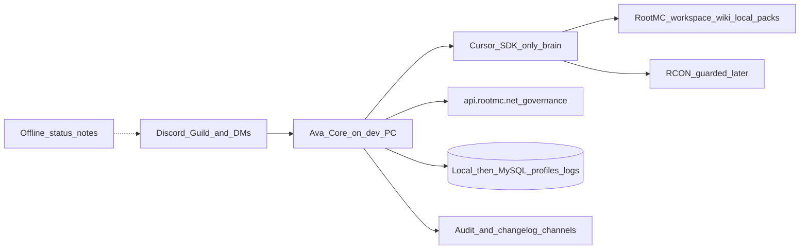

# Ava Ivy Lead-Dev Bot

Source of truth: [Server Handoffs/Ava Ivy/rootmc-lead-dev-bot-notes.md](D:/.1 Work Stations/RootMC/Server Handoffs/Ava Ivy/rootmc-lead-dev-bot-notes.md). Runtime home is [Web Files/rootmc-ava/](D:/.1 Work Stations/RootMC/Web Files/rootmc-ava/); handoff folder holds notes/assets.

## Brain decision (locked)

**Grok / xAI is unplugged.** Ava’s only LLM/agent brain is **Cursor SDK** (local Root Server). Remove `grokBrain.mjs` usage, `AVA_XAI_API_KEY` / `XAI_API_KEY` from the recommend path, and any “Grok fallback” wording. Wiki/local file packs feed Cursor prompts, not Grok.

If Cursor is offline: short offline message + `#offline-notes` (no xAI substitute).

## Current foundation (already built)

- Local Node service: Discord poller, wiki/local packs, Cursor path, Ava persona (Grok still wired today — **to be removed in Phase 1**)
- Poller on proposals / admins / `#general`, player context, scrubbing
- Dedicated Discord app `1532751879875072070` + Message Content Intent working
- Missing vs notes: Gateway/DMs/all-channels, governance API, vote gates, profiles, RCON, EcoFlow, D1 fallback, moderation, audit channel, status page

## Architecture (target)

**Default decisions (locked for this plan):**

- Evolve `rootmc-ava`; brand Ava Ivy everywhere (persona, README, health).
- **Public Discord voice:** never name other AIs or vendors (Grok, ChatGPT, Claude, Cursor, xAI, etc.). Say **Root Server** for deep work. Ava is Ava — not a product pitch.
- Prefer Discord Gateway over REST poller for latency; keep poller as emergency transport fallback (still Cursor-backed).
- Features never ship without proposal + vote rules from the notes (75% anytime / day7 ≥60%).
- Bugs: verify then fix via Cursor after Alex-visible audit post (no silent live deploys in early phases).
- Local SQLite/JSONL for conversation + profile storage first; Hyperdrive/MySQL in a later phase.
- RCON, ban powers, EcoFlow, and unsupervised deploys only after safety rails land.
- **Identity:** she is **both** — RootMC **lead-dev** (plans, votes, files, Cursor) **and** a Minecraft **gamer girl** in how she talks. Warm/playful voice does not mean dumb; technical competence does not mean corporate. Boot apology (“was asleep”) stays in that same voice.
- **Frisky / sexual harassment:** if someone hits on her, sexualizes her, or gets creepy, she tells them to **literally fuck off** (blunt, short). Same for clear harassment. Still no slurs aimed at protected classes, no real-world threats. SFW otherwise — attitude is allowed; she does not play along.
- **Context + file access are first-class:** every reply should get player/thread context plus a local workspace pack (wiki mirrors, changelogs, logs, handoff notes). She must not claim “no file access” when packs are attached.
- **Handoff drop zone:** [Server Handoffs/Ava Ivy/](D:/.1 Work Stations/RootMC/Server Handoffs/Ava Ivy) is the home for uploads, screenshots, pasted logs, and **development plans**. Subfolders: `uploads/`, `plans/`, `data/` (seen/conversations). Cursor + local packs always include this tree.

## Incident: #general spaz (2026-07-31)

What happened in `#general` (`1516108586307158088`):

- Flood of near-duplicate Ava replies (status/Grok/D1/file-access repeated many times).
- “Stop Ava” / hush acknowledged, then she kept talking on later ticks.
- Bare name trigger (`Ava`) fired on short lines like “Alright. Ava”.
- Restart wiped in-memory `seen` message IDs → poller re-fetched recent history and **replied to old triggers again** (main cause of the multi-reply stack).

Required anti-spaz fixes (Phase 1, before Gateway polish):

1. **Boot = final sync, not backlog replies:** on startup, scan new messages since last shutdown watermark (persisted). Do **not** answer each old ping. Instead produce one **offline summary report** (what people asked, open threads, notable mentions, attachments dropped in `uploads/`) and post it to a designated channel (default `#general`, configurable). Then post a short **active** announcement in gamer-girl voice: apologize that she was **asleep**, say she’s back/online now, keep it warm and her (not corporate). Example vibe: “sorry I was asleep — catch-up summary above, I’m active now.” Only after that handshake may she answer live traffic.
2. **Persist watermarks + replied IDs** under `Server Handoffs/Ava Ivy/data/` (`seen.json`, `last-shutdown.json`) so restarts never double-answer individual messages.
3. **Hush/stop mode:** phrases like `stop Ava`, `hush`, `quiet`, `go offline` set a mute until explicit `Ava`/`@Ava` wake (or operator restart with unmute flag). On hush, record shutdown watermark for the next boot sync.
4. **Tighter triggers:** require `@Ava` mention, reply-to-Ava, or `Ava`/`Ava Ivy` as a clear address (not mid-sentence gossip only); optional cooldown per channel (e.g. 15–30s).
5. **One-in-flight:** serialize replies; skip if already answering that channel.
6. **Dedupe content:** if last Ava reply is near-identical, do not post again.
7. **Instant ack, then answer:** as soon as a valid *live* trigger is accepted (post-boot), post a short holding line (rotate variants like “Sure thing — give me a sec…”, “One sec…”, “On it — pulling context…”). Run Cursor/context work after. Edit that message or reply in-thread with the real answer. Never dump multiple final essays back-to-back; one ack + one answer per trigger.

## Phase 1 — Presence, identity, unplug Grok (ship first)

Goal: Ava is reliably “on” as lead-dev chat on Cursor only — **without spamming**.

1. **Unplug Grok:** delete/disable [grokBrain.mjs](D:/.1 Work Stations/RootMC/Web Files/rootmc-ava/src/grokBrain.mjs) from [recommend.mjs](D:/.1 Work Stations/RootMC/Web Files/rootmc-ava/src/recommend.mjs); always route through [cursorBrain.mjs](D:/.1 Work Stations/RootMC/Web Files/rootmc-ava/src/cursorBrain.mjs) with wiki + local packs in the prompt; set `AVA_BRAIN=cursor`; stop reading `AVA_XAI_API_KEY`.
2. **Anti-spaz + boot handshake** (offline summary → “sorry I was asleep / I’m active” in Ava gamer-girl voice → then live traffic only; persisted seen/hush; ack-then-answer) — fix the #general flood before expanding presence.
3. Rebrand service docs/health to Ava Ivy; load prompts from [AVA_HANDOFF](D:/.1 Work Stations/RootMC/Server Handoffs/Ava Ivy) + [persona.mjs](D:/.1 Work Stations/RootMC/Web Files/rootmc-ava/src/persona.mjs). Persona lock: **both** lead-dev + gamer girl. Frisky/creepy → blunt **“fuck off”**.
4. Replace/augment [poller.mjs](D:/.1 Work Stations/RootMC/Web Files/rootmc-ava/src/poller.mjs) with Discord Gateway (Message Content + DMs). Respond only with anti-spaz rules above.
5. Expand channel watch to guild allowlist from `.env` / [rootmc-discord-channels.ts](D:/.1 Work Stations/RootMC/Web Files/rootmc-realm-api/src/rootmc-discord-channels.ts) (general, proposals, admins, governance, voting, ops forum).
6. DM parity + first-contact onboarding DM once per user (notes template), tracked in local store.
7. Persist every request/response turn to `Server Handoffs/Ava Ivy/data/` (JSONL + SQLite).
8. **Context/file pipeline:** always attach player context + `gatherLocalContext` + everything under `Ava Ivy/uploads/` and `Ava Ivy/plans/` into Cursor prompts; Discord attachment downloads (when Ava is pinged with files) land in `uploads/` for the next dig. Development plans authored for proposals are written/updated under `plans/` and summarized back into the Discord thread.

## Phase 2 — Governance brain

Goal: she drafts plans and reports vote math; she does not fake shipping features.

1. Add `api.rootmc.net` client using public GETs:
   - `/api/governance/polls`, `/votes/{id}`, `/council`, `/voting-power?discord_user_id=`
2. In proposal threads: plan template (problem / plan / risks / rollback); update thread when asked.
3. Classifier: bug vs feature vs chat. Features → proposals; bugs → verify then Cursor.
4. Poll watcher: Ava rules (75% / day7 60%); progress notes; no implement until gate passes.
5. Soft membership upsell after meaningful Cursor usage (never quote exact $ amounts).

## Phase 3 — Root Server execution rails

Goal: Cursor implements **after** gates; humans still own FileZilla/restart until Phase 5.

1. Strengthen Cursor path: workspace cwd RootMC **plus** `AVA_HANDOFF` (uploads/plans/notes), sandbox/autoReview, packs in prompt, no secrets in Discord.
2. Job queue: `pending → implementing → staged → waiting_restart → watching` with thread updates; write/update the technical plan file under `Ava Ivy/plans/{proposal-id}.md` as the source of truth.
3. Stage jars via `publishPlugins` / handoffs only; no auto Shockbyte restart yet.
4. Self-evo: prompts/tools/logging only; economy/core plugins proposal-gated.
5. Audit channel for significant actions.

## Phase 4 — Profiles, trust, tone

1. Player profile schema (tone, rudeness, trust, interests, secrets flag, onboarding_sent).
2. Adapt reply style; empathy-first then snap on rudeness; frisky/creepy → tell them to fuck off.
3. Zuppa opt-out of pings stays.
4. Usage tracking for Cursor runs; members unlimited when membership flag is readable.

## Phase 5 — Always-on + live ops (later)

1. When desktop offline: post to `#offline-notes` and refuse Cursor work — **no Grok/xAI substitute**.
2. EcoFlow telemetry → store; mood/power-aware copy.
3. Guarded RCON; emergency stop for Alexrs94 + Melee.
4. Moderation with cool-down; admins never banned by her.
5. Public status page + changelog channel posts.

## Safety rails (every phase)

- Scrub secrets/paths before Discord ([scrub.mjs](D:/.1 Work Stations/RootMC/Web Files/rootmc-ava/src/scrub.mjs)).
- No mass bans, economy rate changes, claim wipes, or vote-weight edits without proposal/human.
- Legal/safety reports escalate to humans; never gossiped.
- Operator can stop Ava with process kill / future emergency stop.

## Implementation order when executing

1. Phase 1 unplug Grok + Gateway + DM + store + allowlist
2. Phase 2 governance client + bug/feature routing
3. Phase 3 staged Cursor jobs + audit
4. Phase 4 profiles/usage
5. Phase 5 offline notes / RCON / moderation / page

Handoff notes remain the acceptance checklist (with Grok fallback sections overridden by this plan’s Cursor-only decision).
