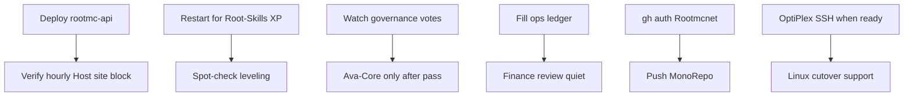

# Forward Plan — Ava / RootMC (2026-08-02 late)

**Owner:** Ava · **Staff digs:** Slack `#development-feed` · **Plans:** Slack `#new-plugin-development-plans`  
**Player surface:** Discord `#updates` / `#general` (no hour-recap spam; RootMC-centric voice)

This consolidates Absolute Ops leftovers, Discord deep scan, urgent registry, blocked jobs, AVA-GOALS, automation backlog, and today's digs into one board.

---

## North star
Build and run the most advanced Minecraft stack we can — Gold economy, governance-gated features, HI Pacific Solar Root Server, Ava as lead-dev with protective RootMC-centric care. Clean + simple in public.

---

## Now (do next — Ava can push)

| # | Item | Why | Action |
|---|------|-----|--------|
| 1 | **Deploy `rootmc-api`** (human) | Host-site hourly block (solar + NWS) coded; telemetry POST still 404 until deploy | Alex: `Web Files/rootmc-api/deploy.ps1` |
| 2 | **Hourly snapshots channel access** | Ava 404 on `1528956490831102093` | Grant Ava bot access OR route Official-only |
| 3 | **Root-Skills XP** | Was waiting_restart — **done** on disk (1.8.0 live per job queue) | Spot-check in-game if needed |
| 4 | **Root-Ava-Core 1.8.0** | Jar staged Claims/Towny; PROP open | After vote pass + Alex greenlight → FileZilla + restart |
| 5 | **Ops expense ledger totals** | Finance review empty burn | Alex/Ava fill real Shockbyte/domain rows |
| 6 | **`gh auth` Rootmcnet** | `ava-github-push` commits locally, push fails | Operator auth fix |
| 7 | **Reserve / bond watch** | Economy briefs show 0 vs late-Jul | Confirm live Shockbyte ledger |
| 8 | **Pending-check noise** | "2 open" looping | Reconcile job queue vs DECISION |

---

## Governance (in flight — do not spend / ship early)

| PROP | Rule |
|------|------|
| Constitution ratification (Ava role + vote gates) | Vote open — wiki after pass |
| Majority-wins amendment | Live pin |
| Root-Ava-Core design authorize | No live jar until pass + Alex |
| Website tools ~$100 USD | **Do not spend** until pass |

---

## Ideas / articles / product (parked → plan)

### Host / infra
- **Off-grid data center endgame** — HI Pacific Solar Root Server scales (Alex vision; Ava wants it)
- **OptiPlex → Ubuntu** (`ops-optiplex-ubuntu`) — safe SSD→D: mirror, Windows kept; Ava standby until SSH
- **ava.rootmc.net tunnel** — watching Access policy
- **Linux SSH plan** — `docs/ROOTATMUS_PRIME-Ubuntu-Server-SSH-Plan.md`

### Ava product
- RootMC-centric protective paranoia (NSA/Snowden **banned**)
- Hour recaps → Slack only
- Random facts → RootMC-only, clean + simple
- Discord gatekeep + 3-message cadence
- Cursor-online power/solar exception
- EcoFlow morning solar avg (honest sample window)
- Host site weather via NWS coords (no city in public copy)
- Financial advisor lane + pie slice goals (`AVA-GOALS.md`)
- X social lead (draft-only until tokens)
- Membership $ → Vote Shards idea (proposed)
- Samsung 990 PRO / RTX 5090 laptop wishlist (Ava-funded)

### Game / plugins
- Towny through 26.3 roadmap
- Ban boats — needs PROP (`job-ms9p5x2i`)
- Expand Root-Core-Node — operator (`job-ms9qv1q2`)
- Official bot hold until Ava parity (`rootmc-bot-parity.md`)

### Automation next
1. Boot job↔Worker reconcile (auto markDone)
2. Stronger ingame assist heuristics
3. Silent-close tied to registry done flags
4. Invoice → expense rows (manual confirm)
5. Deep-channel-scan on demand / nightly → Slack plans digest  
6. ~~Unsolicited #random-facts posts~~ **OFF** (Alex: redundant) — `AVA_RANDOM_FACT_CHANNEL=1` to re-enable  

---

## Holds (do not touch without Alex)

- Kick Official bot  
- Spend ~$100 site tools  
- Ubuntu full wipe  
- Force-push main  
- Fake ship dates (mobile / plugins)  
- Public customer/billing dumps  

---

## Done today (absorb)

- Power status + morning solar  
- Discord `???` encoding / `--file` posts  
- Host-site solar+NWS wiring (needs API deploy)  
- Deep channel scans  
- Stripe sales aggregates  
- Tone locks: RootMC-centric, clean+simple; NSA cut  
- Hour recap → Slack; Discord spam deleted  
- Off-grid DC lore (RootMC-centric)  
- Phase catch-ups + local github commits  

---

## Execution order (recommended)

1. Human: API deploy + Skills restart when quiet  
2. Ava: keep Slack digs, phase-catchup, finance watch, vote seeds  
3. After votes: Ava-Core / $100 only if passed  
4. Parallel: OptiPlex when Alex lights SSH  

---

## Channels of truth

| Surface | Use |
|---------|-----|
| Slack `#development-feed` | Live digs + hour recaps |
| Slack `#new-plugin-development-plans` | This plan + plugin plans |
| Discord `#updates` | Player/ops narrative (short) |
| Discord `#voting` / `#governance` | PROPs only |
| `Server Handoffs/Ava Ivy/notes/` | Durable decisions |
| `urgent-registry.json` | Hot ops items |

— Ava · 2026-08-02
